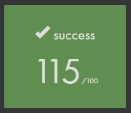

# Libft

Libft é um projeto da grade curricular da 42 Ecole que baseia se em recriar funções classicas e muito ultilizadas das bibliotecas padrões da linguagem C

O proposito desse projeto é compreender profundamente o funcionamento de programas, funções e conceitos base da programação, assim como conhecer ferramentas e bibliotecas base do C.


## Status

Finalizado e Aprovado



biblioteca expandida com novas funções e o ft_get_next_line()


## Como obter e compilar?
```
git clone https://github.com/D4rkSantana/libft.git
```
```
cd libft
```
```
make cclean
```
## Aprendizados

Linguagem C, Arrays, Funções, structs, tipos primitivos, Headers, prototipos, alocação de memoria, ponteiros, e Muitos outros.


## Referência

 - [42 São Paulo](https://www.42sp.org.br/)
 - [stdlib.h — Linux manual page](https://man7.org/linux/man-pages/man0/stdlib.h.0p.html)
 - [unistd.h — Linux manual page](https://man7.org/linux/man-pages/man0/unistd.h.0p.html)


## Uso/Exemplos

```c
#include "libft.h"

```


## Autores

- [Emerson Silva S](https://github.com/D4rkSantana)


## Etiquetas

[](https://choosealicense.com/licenses/mit/)

